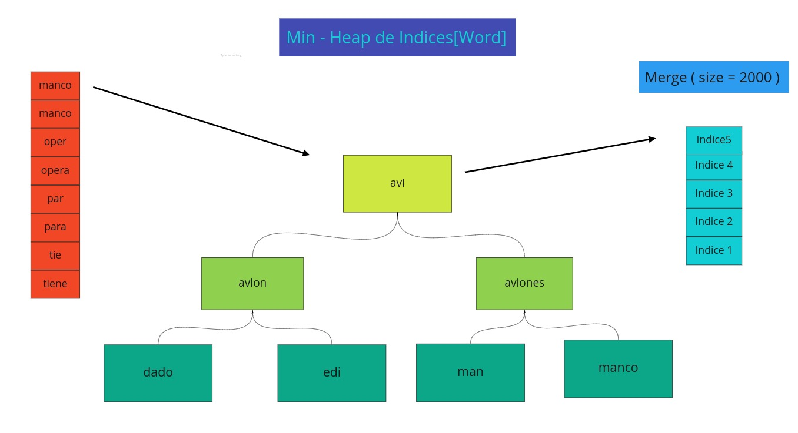
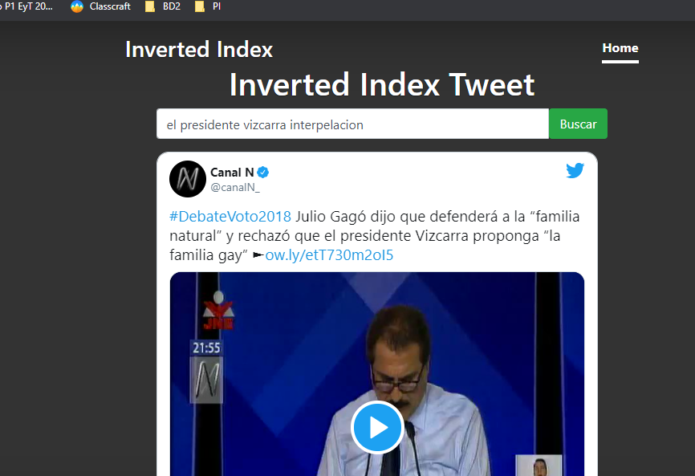

# Proyecto 2 de Base de Datos

## Integrantes

| Nombre y Apellidos | Código de alumno |
|-|-|
|Victor Ostolaza | 201910049 |
|Jorge Vásquez	| 201310292 |
|Jorge Rebosio | 201820025|


## Descripcion
En este proyecto  se construyó el índice invertido para tweets de forma eficiente, en memoria secundaria. Además, se construyó un montor de búsqueda, para realizar consultas eficientes de términos dentro de los tweets, y recuperar los tweets.  

## Cargar Tweets
Como la cantidad de Tweets en de cada archivo de Tweets es mucha, traer toda la información de un archivo a RAM sería ineficiente. Por esa razón, se crea la funcion llamada `CreateChunks`, que recibe un archivo de Tweets como parámetro. Esta función parte cada archivo de Tweets en archivos más pequenos, que a lo máximo tendrán 2000 Tweets. Ahora que se tienen archivos pequenos de Tweets , es más eficiente traer los datos a RAM para crear el Indice Invertido. Por eso, una vez terminado el proceso de CreateChucks, se pasará a preprocesar los Tweets y  crear los archivos de Indice Invertido. 

## Preprocesamiento de Tweets

Para preprocesar y crear los índices para los archivos de Tweets se llama a la función CreateIndex, que recibe como parámetro a un archivo de Tweets. Esta función primero prepocesará cada Tweet. 

Dentro de esta función se llamará a la función `TreatData()` que será la encargada de preprocesar cada Tweet del archivo. Este preprocesamiento lo realizará con la ayuda de otras dos funciones : `removePunctuation()` y `removeSpecialCharacters()`.  

Se procesa cada Tweet para eliminar cada palabra de la lista de Stopwords, de caracteres especiales y de signos de puntuación.

Se usa la libreria NLTK, para poder hacer el proceso de stemming correctamente a la palabras de espanol. Este proceso consiste en reducir a su raíz o prefijo un grupo de palabras similares en estructura y significado. 

Una vez se haya preprocesado todo el archivo de tweets se construyen los archivos de Indice Invertido que se pueden observar en la carpeta out.


## Gestion de Memoria Secundaria

Como no se puede leer todos los índices de todos los archivos a la vez, creamos una estructura de datos de tipo árbol Min Heap en la cual se irá insertando un puntero por cada archivo, mientras el puntero no llegue al final del archivo. 

Inicialmente al Min Heap se le inserta el puntero al primer índice de cada archivo. Después,  cuando el Min Heap este completo( se haya insertado un puntero por archivo ), se elimina el puntero que esta en el root del Min Heap( índice con word lexicograficamente menor ) y se anade este puntero al diccionario Merge. Asimismo, se agrega al Min Heap el puntero que apunta al índice siguiente del indice que se acaba de eliminar. 

Debido a que cuando se inserte un índice del objeto que contiene a los punteros al Min Heap, el puntero que apuntaba a ese índice pasará a apuntar al siguiente elemento de su respectivo archivo, se lograrán insertar todos los índices de todos archivos. Es así que la complejidad de formar la lista final de índices sera O( N log ( N / S ) ) donde S es la máxima cantidad de índices puede tener cada archivo final de índices y N es la cantidad inicial de índices.

Para este proyecto , S tiene el valor de 2000. Es decir, la cantidad de índices máxima que puede tener un archivo final de Indice Invertido.  

Todo este proceso ocurre dentro de la función `generateMergeIndex()`, y terminará cuando se hayan leído todos los índices de todos los archivos. 

El resultado final de la unión de los archivos de Indice Invertido se puede observar en la carpeta Index.





## Query
Se explicará como nuestro motor de búsqueda realiza una consulta. Primero, para cada palabra de la consulta se llama a la función `getIndexSearch` , la cual mediante un algoritmo de búsqueda binaria encuentra y retorna el archivo donde posiblemente se encuentra el índice de la palabra. Luego ,  se llama a la función `getIndexWord` que también realiza un algoritmo de búsqueda binaria dentro del archivo que devuelve `getIndexSearch` , y finalmente retorna el índice de la palabra que se busca. 

La complejidad para hallar los índices de todas la palabras de una Query es igual a O( m (log( K ) + log( S ))) . Donde K es la cantidad de archivos de índices que hay,  S es la cantidad máxima de índices por archivo y  'm' es la cantidad de palabras en la consulta. 

Una vez se obtenga el índice invertido de las palabras del Query, se calcula el Score aplicando similitud de coseno sobre el índice invertido. Una vez calculado este Score, se ordena de forma descendiente y se devuelve los k primeros(que por defecto son 5). 


## Requisitos

* Flask

* FlaskCors

* Python

* Servidor local para cargar pagina

## Tiempos de ejecucion
* Carga los tweets : 2  minutos
* Construccion del Indice Invertido: 5 minutos
* Tiempo promedio por query:  1 segundo


## Guia para ejecutar


Ejecutar :
```sh
python3 init.py
```

Para observar el proyecto dirijase a la siguiente direccion de su servidor local.

```sh
127.0.0.1:8080
```

## Videos
* [Explicación del proyecto](https://www.youtube.com/watch?v=TArJYOTmYt8&feature=youtu.be)

* [Pruebas funcionales](https://www.youtube.com/watch?v=77B7T_GNKPI)
## Imagenes del Motor de busqueda




